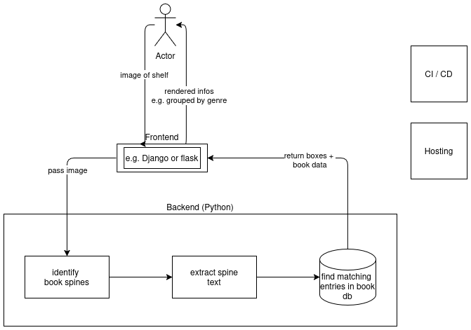

# Journey to shelfspy - a blog

shelfspy is a webapp which helps users to find interesting books in a shelf or open book case. A skilled vibe-coder might be able to build the thing in less than a day, but I am here for the journey - about which I will write in this blog.

## 2025-10-20 Getting started

### Goals
🏋️ My primary goal is to 
* improve my technical skills as machine learning and software engineer
* exercise shipping and communication discipline
* build something end-to-end. 

📝 The goal of this blog is to keep my motivation high by "releasing" something regularly - small work increments as proxy for actual releases. 

I will try [Mitchell Hashimoto's approach to large projects](https://mitchellh.com/writing/building-large-technical-projects)

### Overview (for the first version)

The target process including breakdown in components ...
1. User takes a photo of a shelf or open book case
2. Uploads the image to the app
3. Image is passed to backend
4. Within the backend ...
   1. Find all book spines and draw bounding boxes around them (computer vision)
   2. Extract text in book spines (e.g. using classical OCR)
   3. Find the book in a database
5. Return bounding boxes + found information to frontend
6. Frontend displays the data back to the user (e.g. grouped by genre, sorted by popularity, etc.)

Additionally, we have separate components for CI/CD and hosting.

Process and storage of tracking data, monitoring etc. is missing on purpose.
